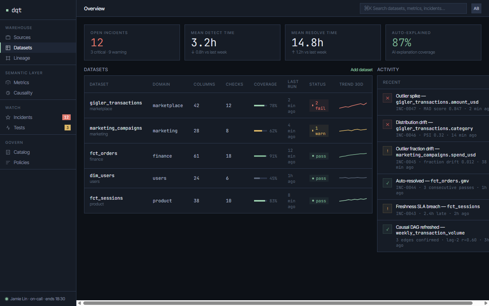
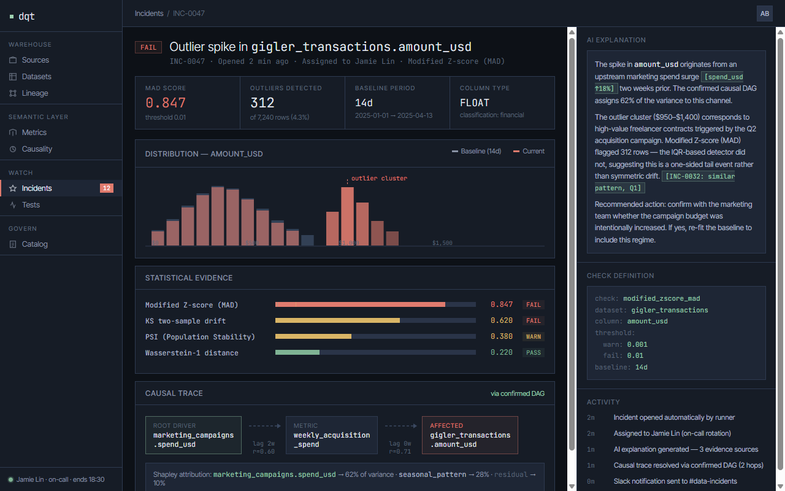
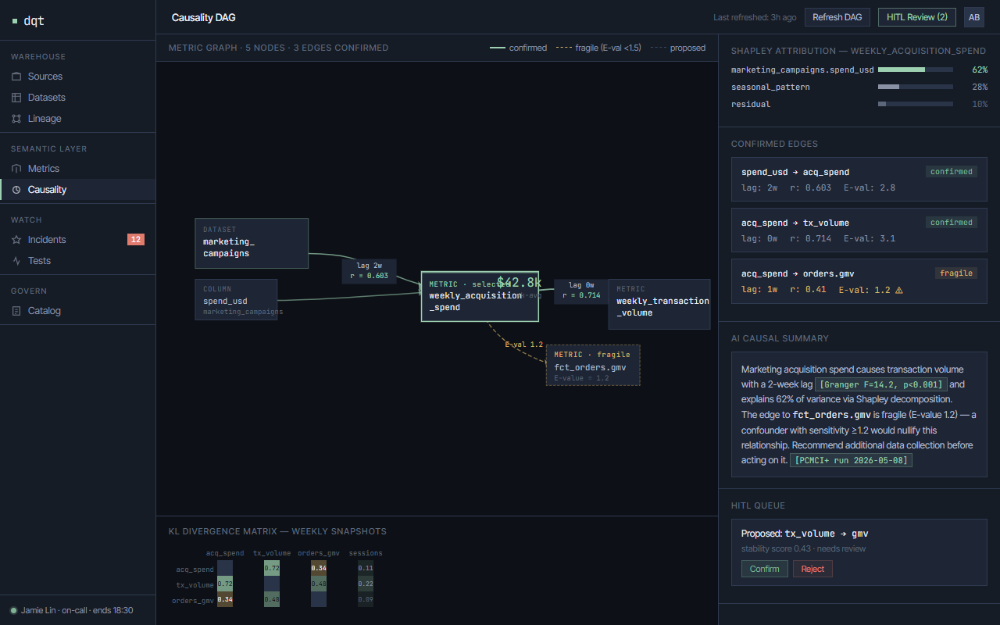
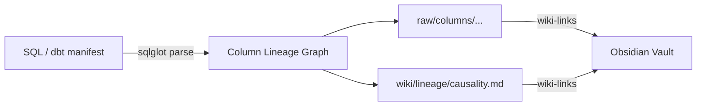
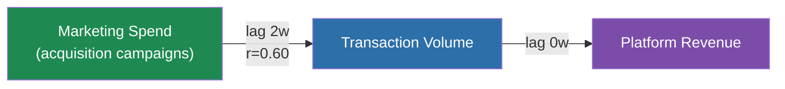
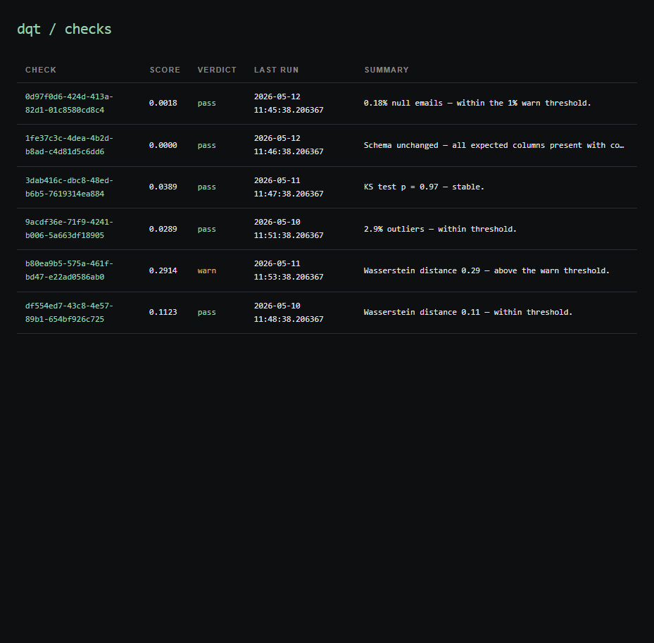
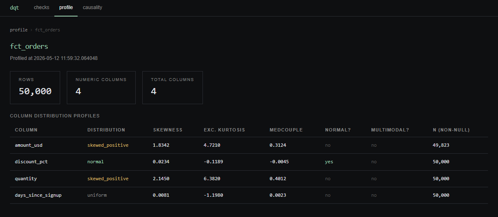
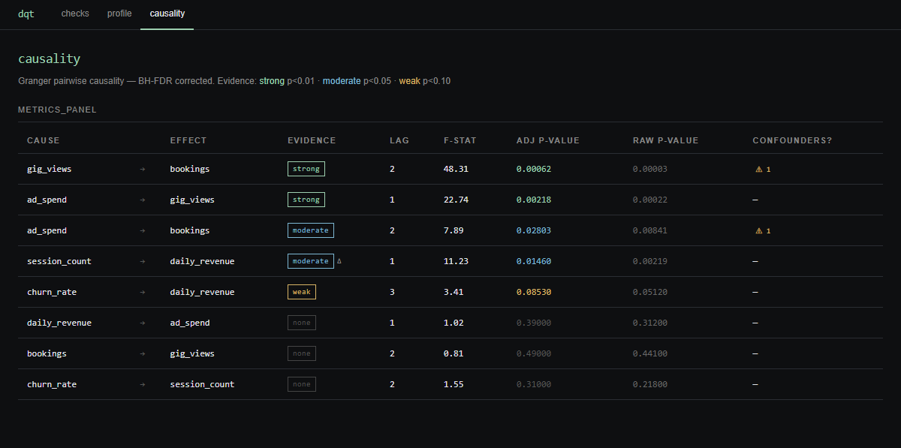
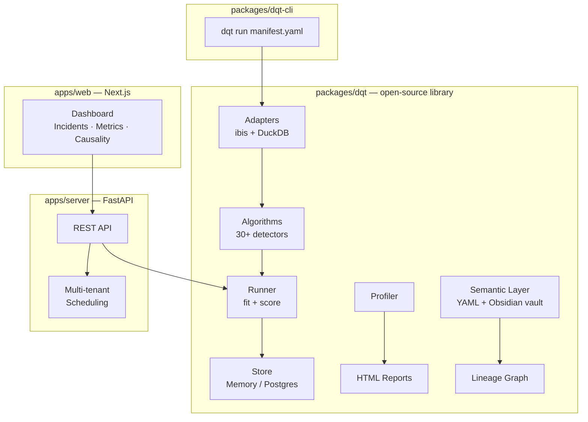

# 質 dqt

**Open-source data quality, lineage, semantic layer & causality — for dbt, warehouses and data lakes.**

[](https://www.python.org/downloads/)
[](LICENSE)
[](https://pypi.org/project/dqtlib/)
[](docs/releases/v0.4.5.md)

Inspired by **Great Expectations** · **Soda** · **Elementary** · **Google Dataplex** — and goes further than each.

---

> **質** (shitsu) — quality, substance, the inner nature of a thing. The kanji points to what something truly is, not how it appears. dqt is meant to work the same way: concerned with the truth of the data, not its surface. The mark is also a quiet acknowledgment of a tradition I have learned much from — one in which quality is one of its most distinguishing characteristics, and craft and precision are understood to be the same thing. — *Anton Barr*

---

| Tool | What dqt adds on top |
|------|----------------------|
| Great Expectations | Statistical detectors (MAD, KS, PSI, Wasserstein), causal discovery, AI explanations |
| Soda | 30+ detector algorithms, column-level lineage, semantic layer, Obsidian vault writer |
| Elementary | Full statistical/ML detector library, causal DAGs, HITL review loop, AI incident explanation |
| Google Dataplex | pip-installable, open-source, works offline, causality analysis, no proprietary lock-in |

---

## What is dqt?

**dqt** is a Python library, CLI, and optional service for watching data quality in SQL warehouses and data lakes. It goes beyond declarative threshold checks to explain *why* data moved — using statistical drift detection, column-level lineage, and causal discovery.

The core library (`packages/dqt`) is zero-dependency on web or server infrastructure. It runs standalone in notebooks, CI pipelines, and orchestration tasks (Airflow, Dagster, Prefect). The optional FastAPI server (`apps/server`) adds multi-tenancy and scheduling. The Next.js dashboard (`apps/web`) gives a power-user UI for incidents, metrics, and the causality DAG.

---

## Screenshots

**Overview** — fleet KPIs, dataset health table with sparklines, live activity feed



**Incident detail** — statistical evidence, distribution overlay, causal trace, AI explanation



**Causality DAG** — confirmed metric→metric graph, Shapley attribution, KL divergence matrix



---

## Core capability hierarchy

### Data Lineage

**Column-level lineage** parsed from warehouse SQL via [sqlglot](https://github.com/tobymao/sqlglot), plus dbt manifest ingestion and OpenLineage event ingestion. Lineage is stored as an Obsidian-compatible knowledge vault — `raw/` for source metadata, `wiki/` for synthesised relationships — where every entity is a `.md` document and relationships are `[[wiki-links]]`.



Lineage feeds the **failure blast radius**: from any incident, dqt traces downstream impact across datasets automatically.

---

### Semantic Layer

**Metric definitions** as YAML contracts: `id`, `name`, `kind`, `source`, `dimensions`, `owner`, `description`, `unit`. Compatible with dbt's semantic layer — dqt reads `semantic_models.yml` directly.

Every entity (dataset, column, metric) lives as a single `.md` document. Relationships use `[[wiki-links]]`. Embeddings on descriptions power semantic search and the AI agent's grounding.

The vault layout is inspired by [Andrej Karpathy's LLM Wiki](https://gist.github.com/karpathy/442a6bf555914893e9891c11519de94f) pattern: `raw/` holds atomic source-of-truth documents (your semantic layer — editable, version-controlled), `wiki/` holds synthesised knowledge produced by the system (discovered lineage, causal edges, derived metrics).

```
vault/
├── raw/
│   ├── datasets/orders.md        # source-of-truth metadata
│   └── columns/orders/amount.md  # per-column atomic note
└── wiki/
    ├── metrics/revenue.md         # derived metrics
    └── lineage/causality.md       # discovered causal edges
```

Example semantic definition (`semantic.yaml`):

```yaml
version: "1"
datasets:
  - id: gigler_transactions
    description: "Transaction records from the Gigler freelance marketplace."
    owner: "platform-analytics@gigler.com"
    domain: "platform"
    freshness_sla_hours: 4
    columns:
      - name: amount_usd
        description: "Gross transaction value in USD."
        classification: internal
        pii: false
      - name: rating
        description: "Buyer satisfaction rating 1.0–5.0. NULL if not yet completed."
        classification: internal
        pii: false
```

---

### Data Quality Checks

The largest section of the library. Every **detector** exports a class implementing `fit(reference) → state`, `score(current, state) → DetectorResult`, and a registered slug. All detectors return the same `DetectorResult` shape — `verdict`, `score`, `plain_english` — so they compose uniformly.

#### Detector catalog

**Basic / completeness**

| Slug | Description | Fail threshold |
|------|-------------|----------------|
| `completeness_rate` | Fraction of non-null values | < 0.90 |
| `null_fraction` | Fraction of rows where column is NULL | > 0.05 |
| `uniqueness_rate` | Fraction of distinct values | < 0.80 |
| `validity_rate` | Fraction of values matching the rule | < 0.90 |
| `schema_change` | 1.0 if schema changed, 0.0 if unchanged | any change |
| `referential_integrity_rate` | FK values present in parent table | < 0.95 |
| `volume_change_ratio` | Fractional deviation from baseline row count | > 0.25 |
| `freshness_seconds_behind` | Seconds since most recent row timestamp | > 86400s |

**Range & pattern**

| Slug | Description | Fail threshold |
|------|-------------|----------------|
| `value_in_range_violation` | Fraction of values outside `[min, max]` | > 1% |
| `set_membership_violation` | Fraction of values not in the allowed set | > 1% |
| `set_exclusion_violation` | Fraction of values in the forbidden set | > 1% |
| `regex_match_violation` | Fraction not matching any regex pattern | > 1% |
| `string_length_violation` | Fraction with length outside `[min_len, max_len]` | > 1% |
| `date_format_violation` | Fraction not parseable as the given date format | > 1% |
| `string_case_violation` | Fraction with wrong case | > 1% |
| `monotonicity_violation` | 1.0 if ordering violated | any violation |
| `column_pair_violation` | Fraction of rows where pair comparison fails | > 1% |
| `composite_uniqueness_violation` | Fraction of duplicate rows on composite key | > 1% |
| `sql_assertion_violation` | Fraction of rows failing a custom SQL condition | > 1% |

**Statistical aggregates**

| Slug | Description |
|------|-------------|
| `numeric_mean_shift` | Z-score of mean deviation from baseline |
| `max_in_range` / `min_in_range` | MAX or MIN outside `[min, max]` |
| `median_in_range` | Median outside `[min, max]` |
| `stddev_in_range` | STDDEV outside `[min, max]` |
| `sum_in_range` | SUM outside `[min, max]` |
| `cardinality_in_range` | `COUNT(DISTINCT col)` outside `[min, max]` |
| `quantile_in_range` | Specified quantile outside `[min, max]` |

**Outlier detection (univariate)**

| Slug | Description | Fail threshold |
|------|-------------|----------------|
| `mad_outlier_fraction` | Fraction with `\|modified Z\| > 3.5` (MAD-based) | > 5% |
| `double_mad_outlier_fraction` | Asymmetric double-MAD; robust on skewed distributions | > 5% |
| `zscore_outlier_fraction` | Fraction with `\|Z\| > threshold`; valid only under normality | > 5% |
| `adjusted_boxplot_fraction` | Medcouple-adjusted Tukey fences (Hubert & Vandervieren 2008) | > 5% |
| `isolation_forest_fraction` | Fraction classified as anomalies by Isolation Forest | > 10% |
| `outlier_fraction_drift` | Deviation of current outlier % from historical baseline range | any drift |

**Drift**

| Slug | Description |
|------|-------------|
| `ks_pvalue` | 1 − p-value from two-sample KS test; warns p < 0.05 |

**Time series**

| Slug | Description | Fail threshold |
|------|-------------|----------------|
| `stl_residual_zscore` | Max absolute Z-score of STL residuals over the window | > 5.0 |
| `date_part_missing_fraction` | Fraction of expected date buckets with no data | > 5% |

#### Check YAML format

```yaml
version: "1"

source:
  type: duckdb
  database: ./warehouse.duckdb

checks:
  - schema_name: public
    table_name: orders
    column_name: amount
    detector_slug: mad_outlier_fraction
    scope:
      mode: incremental       # full | incremental | custom_sql
      key_col: created_at
      since: "2024-01-01"
    sampling_pct: 25.0        # sample 25% of matching rows
    baseline:
      window_days: 14         # reference window for fit()

  - schema_name: public
    table_name: orders
    column_name: status
    detector_slug: set_membership_violation
    params:
      allowed_values: ["pending", "complete", "cancelled", "refunded"]

  - schema_name: public
    table_name: orders
    detector_slug: freshness_seconds_behind
    params:
      timestamp_col: created_at
```

**Scoping modes:**
- `full` — entire table, no filter
- `incremental` — filter by `key_col >= since` (date or id column)
- `custom_sql` — arbitrary WHERE clause, e.g. `"region = 'EMEA' AND status != 'test'"`

**Sampling:** set `sampling_pct` on any check to reservoir-sample large tables. Default is 100k rows or `TABLESAMPLE` where the engine supports it.

#### Python API

```python
from dqt import Check, CheckScope, Runner, MemoryStore

check = Check(
    schema_name="public",
    table_name="orders",
    column_name="amount",
    detector_slug="mad_outlier_fraction",
    scope=CheckScope(mode="incremental", key_col="created_at", since="2024-01-01"),
    sampling_pct=25.0,
)

runner = Runner(MemoryStore())
runner.fit(check, adapter)          # fit reference distribution
result = runner.run(check, adapter) # score against reference

print(result.verdict)        # Verdict.PASS | Verdict.WARN | Verdict.FAIL
print(result.score)          # 0.0082 (fraction of outliers)
print(result.plain_english)  # "0.82% of values are outliers — within the 1% warn threshold"
```

---

### Causality Analysis

**Granger causality**, lag-correlation analysis, and optional **PCMCI+** (via tigramite) discover directed metric→metric influence with lag, confidence, and E-values (sensitivity to unobserved confounders).

The discovery pipeline runs on the metric time series panel, prunes by stability selection across bootstrap resamples, and annotates edges with Transfer Entropy magnitudes and Granger F-statistics. Discovered edges are *proposed* — owners review and confirm in the HITL gate before they enter the production DAG.



**Attribution at incident time:** Shapley value decomposition over the confirmed DAG explains a metric's current move as a fair-share split across upstream parents.

**Honest causal claims:** every reported edge carries an E-value. Edges with E-value < 1.5 are flagged as fragile.

---

### AI Explanations

**Claude API integration** (Anthropic). The agent reasons over: statistical evidence, the confirmed causal DAG, lineage upstreams, semantic descriptions, recent changepoints, and prior similar incidents.

The agent operates on Pearl's ladder of causation explicitly:
1. **Association** — describe what changed and which detector fired
2. **Intervention** — query the causal DAG for likely drivers via do-calculus identification
3. **Counterfactual** — answer "would this have happened anyway?" using DoWhy refuters

Output is structured `{plain_english, evidence[], confidence, follow_up_questions[]}`. Every assertion cites the statistical evidence that supports it — no hallucinated SQL, no unsupported claims.

---

## Works with your data, wherever it lives

| Type | Supported |
|------|-----------|
| Files | CSV, Parquet (via DuckDB) |
| OLTP databases | PostgreSQL, MySQL |
| Analytical databases | ClickHouse, DuckDB |
| Cloud data warehouses | BigQuery, Snowflake, Redshift, Databricks SQL |
| Data lakes | Any Parquet/CSV on S3, GCS, Azure Blob (via DuckDB/ibis) |
| dbt projects | dbt Cloud + Core artifact ingestion |
| OpenLineage | Event stream ingestion |

Every warehouse is accessed through the `WarehouseAdapter` protocol backed by [ibis-framework](https://ibis-project.org/). Push-down aggregations run in the warehouse; statistical work on samples runs in embedded DuckDB — uniform detector code across all engines.

**Cost guards:** BigQuery and Snowflake adapters call `dryRun` / `EXPLAIN` before any query. If estimated bytes exceed the source's `max_bytes_per_query` limit (default 50 GB) the run is refused. All adapters run in read-only transactions — dqt never writes to your warehouse.

Source configuration in YAML:

```yaml
# DuckDB (local file or in-memory)
source:
  type: duckdb
  database: ./warehouse.duckdb

# CSV file
source:
  type: csv
  path: ./data/orders.csv
  table_name: orders

# Parquet file
source:
  type: parquet
  path: ./data/orders.parquet
  table_name: orders

# PostgreSQL
source:
  type: postgres
  host: localhost
  port: 5432
  database: analytics
  username: dqt_reader
  password: "${POSTGRES_PASSWORD}"
```

---

## CLI quick start

```bash
pip install dqtlib
```

```bash
# Run all checks in a manifest
dqt run checks-manifest.yaml

# Run without re-fitting baselines (faster for CI)
dqt run checks-manifest.yaml --no-fit

# JSON output for downstream processing
dqt run checks-manifest.yaml --output json

# Check version
dqt version
```

Exit codes: `0` = all pass, `2` = one or more checks failed.

Full annotated manifest:

```yaml
version: "1"

source:
  type: duckdb
  database: ./warehouse.duckdb

semantic:
  tables:
    - schema: public
      name: orders
      description: "Customer order transactions"
      columns:
        - name: amount
          description: "Order total in USD"
          unit: USD
        - name: status
          description: "Order lifecycle status"
          classification: internal

checks:
  # Outlier detection on a numeric column — incremental, sampled
  - schema_name: public
    table_name: orders
    column_name: amount
    detector_slug: mad_outlier_fraction
    scope:
      mode: incremental
      key_col: created_at
      since: "2024-01-01"
    sampling_pct: 25.0
    baseline:
      window_days: 14

  # Set membership on a categorical column — full table scan
  - schema_name: public
    table_name: orders
    column_name: status
    detector_slug: set_membership_violation
    params:
      allowed_values: ["pending", "complete", "cancelled", "refunded"]

  # Freshness check — no column needed
  - schema_name: public
    table_name: orders
    detector_slug: freshness_seconds_behind
    params:
      timestamp_col: updated_at

  # Drift detection — compare current distribution to last 14 days
  - schema_name: public
    table_name: orders
    column_name: amount
    detector_slug: ks_pvalue
    baseline:
      window_days: 14
```

---

## HTML Reports

**Self-contained HTML reports** for profiling and DQ check results — light/dark themed, no server required, theme toggle persisted in `localStorage`.

```bash
pip install "dqt[reports]"
```

```python
from dqt.reporting.html_report import profiling_report, quality_report, save_report

# Column profiling report: distributions, nulls, cardinality, top values
html = profiling_report(profile, title="Orders Dataset — Weekly Profile")
save_report(html, "reports/orders_profile.html")

# DQ check results report: verdict table, score charts, plain-English summaries
html = quality_report(results, title="Orders — DQ Run 2024-01-15")
save_report(html, "reports/orders_dq.html")
```

Reports include: column-level distribution charts, verdict summary table (pass/warn/fail with scores), plain-English summaries from the detector, and a timestamp + source reference. Zero external dependencies at render time — the HTML file is fully self-contained.

---

## Python library quick start

```python
import duckdb
from dqt import Check, CheckScope, Runner, MemoryStore
from dqt.adapters.duckdb.adapter import DuckDBAdapter

# Connect to a DuckDB warehouse
conn = duckdb.connect("warehouse.duckdb")
adapter = DuckDBAdapter(conn)

# Define a check
check = Check(
    schema_name="main",
    table_name="orders",
    column_name="amount",
    detector_slug="mad_outlier_fraction",
    scope=CheckScope(
        mode="incremental",
        key_col="created_at",
        since="2024-01-01",
    ),
    sampling_pct=10.0,
)

# Fit baseline and run
store = MemoryStore()
runner = Runner(store)
runner.fit(check, adapter)
result = runner.run(check, adapter)

print(f"Verdict : {result.verdict.value}")       # pass | warn | fail
print(f"Score   : {result.score:.4f}")            # 0.0082
print(f"Summary : {result.plain_english}")
```

---

## Local Dashboard

Run checks, then open a browser UI to explore what happened — no server setup required.

```bash
pip install "dqtlib[dashboard]"
```

```python
import uvicorn
from dqt import Runner, MemoryStore
from dqt.dashboard import create_app

store = MemoryStore()
runner = Runner(store)

# ... run your checks against store ...

app = create_app(store=store)
uvicorn.run(app, host="127.0.0.1", port=8080)
# → open http://127.0.0.1:8080
```

Or from the CLI:

```bash
dqt dashboard --port 8080
```

The dashboard has three views — **checks**, **profile**, and **causality** — navigated from the top bar. It uses an in-memory store by default; results exist for the lifetime of the process. See [docs/dashboard.md](docs/dashboard.md) for the full guide including the Jupyter notebook pattern and Python API.

**Checks** (`/`) — one row per check showing the latest score, pass/warn/fail verdict, timestamp, and plain-English summary. Click any row to see the full run history.



**Profile** (`/profile`, `/profile/<dataset>`) — column-level distribution statistics for each dataset snapshot: distribution shape (normal / skewed / heavy-tailed / multimodal / uniform), skewness, excess kurtosis, medcouple robust skewness, normality flag, and non-null count. Populated by calling `store.save_profile_report()` with the output of `profile_dataframe(df)`.



**Causality** (`/causality`) — pairwise Granger causality report with Benjamini–Hochberg FDR correction. Shows cause → effect direction, AIC-selected lag, F-statistic, adjusted and raw p-values, evidence strength (strong / moderate / weak / none), and confounder candidates. The ∆ symbol marks edges where auto-differencing was needed to achieve stationarity.



---

## Architecture



The library (`packages/dqt`) is the only publishable artifact. It has zero dependency on FastAPI, Redis, or any web concept. It degrades to an in-memory results store when no Postgres is configured — notebooks and CI pipelines work out of the box.

The server (`apps/server`) imports the library and adds auth, multi-tenancy, scheduling via arq, and REST/WebSocket APIs. The web dashboard connects to the server.

---

## Comparison

| Feature | dqt | Great Expectations | Soda | Elementary | Google Dataplex |
|---------|-----|--------------------|------|------------|-----------------|
| Declarative checks | ✅ | ✅ | ✅ | ✅ | ✅ |
| Statistical detectors | ✅ 30+ | ⚠️ basic | ⚠️ basic | ❌ | ⚠️ basic |
| Outlier detection | ✅ MAD, IQR, IF, ... | ❌ | ❌ | ❌ | ❌ |
| Drift detection | ✅ KS, PSI, Wasserstein | ❌ | ❌ | ✅ | ✅ |
| Causal discovery | ✅ Granger, PCMCI+ | ❌ | ❌ | ❌ | ❌ |
| Semantic layer | ✅ Obsidian vault (Karpathy LLM Wiki pattern) | ❌ | ❌ | ❌ | ✅ |
| Column lineage | ✅ sqlglot | ❌ | ❌ | ✅ | ✅ |
| AI explanations | ✅ Claude | ❌ | ❌ | ❌ | ❌ |
| HTML reports | ✅ | ⚠️ Data Docs | ⚠️ | ❌ | ❌ |
| pip installable | ✅ | ✅ | ✅ | ✅ | ❌ |
| Open-source | ✅ MIT | ✅ | ✅ | ✅ | ❌ |

---

## Installation

```bash
# Core library + CLI
pip install dqtlib

# + local dashboard (FastAPI + HTMX browser UI)
pip install "dqtlib[dashboard]"

# + matplotlib for HTML profiling and quality reports
pip install "dqtlib[reports]"

# + Prophet for time-series forecasting detectors
pip install "dqtlib[forecast]"

# + tigramite for PCMCI+ causal discovery
pip install "dqtlib[causal]"

# + deep learning detectors (autoencoder, etc.)
pip install "dqtlib[deep]"

# Everything
pip install "dqtlib[all]"
```

Requires Python ≥ 3.12.

---

## Documentation

Full API reference with Gigler sample dataset examples:

| Doc | Description |
|-----|-------------|
| [Quickstart](docs/api/quickstart.md) | End-to-end example — load a CSV, run checks, read results |
| [Detectors reference](docs/api/detectors.md) | All 38 detectors with parameters and Gigler examples |
| [Getting started](docs/getting-started.md) | **Start here** — first check in 5 min, drift detection, CLI, dashboard, profiling, Granger causality, quick-reference slug table |
| [Checks & Runner API](docs/api/checks-and-runner.md) | Check model, CheckScope, CheckFilter, BaselineConfig, Runner, MemoryStore |
| [Results & AI explanations](docs/api/results.md) | RunResult fields, Incident fields, causal discovery results, agent explanation output, MemoryStore queries |
| [Lineage API](docs/api/lineage.md) | LineageGraph from SQL (sqlglot), dbt manifest ingestion, OpenLineage, graph queries |
| [Vault: LLM Wiki structure](docs/api/vault.md) | write_vault() output, raw/ frontmatter schema, wiki/ generated files, custom node types, Obsidian |
| [YAML check format](docs/api/yaml-reference.md) | Complete YAML config reference with annotated Gigler example |
| [CLI reference](docs/api/cli-reference.md) | `dqt run`, `dqt version`, `dqt dashboard`, CI/CD integration |
| [Local dashboard](docs/dashboard.md) | Browser UI for check results — install, quickstart, notebook pattern, limitations |
| [Adapters](docs/api/adapters.md) | LocalAdapter, PostgresAdapter, custom adapter protocol |
| [Semantic layer & LLM Wiki](docs/semantic-layer.md) | Build your data knowledge graph from Trello tickets, SQL, and BI reports using Karpathy's LLM Wiki pattern + Claude Code |
| [Release notes](docs/releases/README.md) | Per-version changelog — features, fixes, upgrade notes |

The [Gigler sample dataset](examples/gigler/) ships with the repo — four CSVs (transactions, prices, vendor stats, marketing campaigns) covering 5 quarters. Every doc page uses it for real, runnable examples.

---

## Project layout

```
dqt/
├── packages/
│   ├── dqt/               # open-source library (pip: dqtlib)
│   ├── dqt-cli/           # dqt command-line tool
│   └── dqt-types/         # generated TypeScript types (git-ignored)
├── apps/
│   ├── server/            # FastAPI multi-tenant service
│   ├── worker/            # arq scheduled check runner
│   └── web/               # Next.js 14 App Router dashboard
├── shared/
│   ├── config/            # JSON enum definitions (single source of truth)
│   └── schemas/           # JSON Schema for checks, metrics, policies
├── examples/              # runnable notebooks and scripts
├── docs/                  # architecture docs, algorithm references
└── reference_data/        # synthetic demo warehouse + dbt project
```

---

## License

MIT — see [LICENSE](LICENSE).
