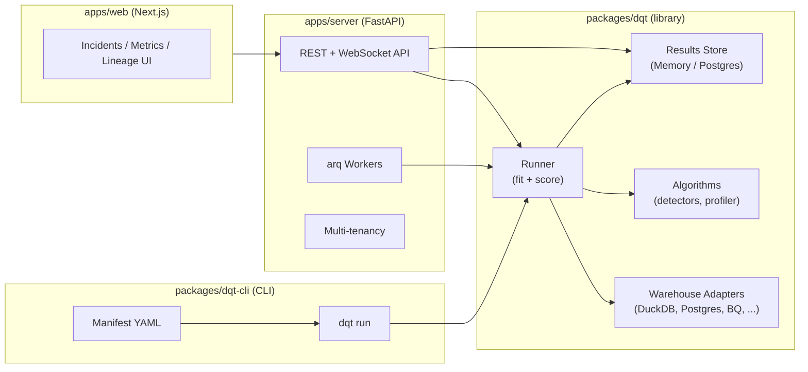

# dqt — data questioning, observability, and causality

dqt is an open-source Python library for questioning your SQL warehouses. It detects drift, anomalies, schema changes, and freshness violations — and explains *why* metrics moved using column-level lineage and a causal discovery layer. The library runs standalone in notebooks and CI pipelines; the FastAPI server adds multi-tenancy, scheduling, and a power-user web UI.

## Architecture



## Quick install

```bash
pip install dqt
```

For the CLI:

```bash
pip install dqt-cli
```

## Documentation

| Document | Description |
|---|---|
| [Python library quickstart](quickstart/python-library.md) | Run your first check in Python |
| [CLI reference](cli/README.md) | `dqt run` command, manifest format |
| [YAML check reference](checks/yaml-reference.md) | Every check field and detector slug |
| [Architecture overview](architecture/overview.md) | C4 diagram, module map, design decisions |

## Detectors at a glance

dqt ships detectors across seven groups:

| Group | Example slugs |
|---|---|
| `basic` | `completeness`, `null_fraction`, `volume`, `validity`, `freshness_seconds_behind` |
| `schema` | `schema_change` |
| `referential` | `referential_integrity_rate` |
| `drift` | `ks_pvalue` |
| `outliers_uni` | `mad_outlier_fraction`, `double_mad_outlier_fraction`, `zscore_outlier_fraction`, `adjusted_boxplot_fraction` |
| `outliers_multi` | `isolation_forest_fraction` |
| `timeseries` | `stl_residual_zscore` |

Each detector exposes `fit(reference_df) → state` and `score(current_df, state) → DetectorResult`. See the [YAML check reference](checks/yaml-reference.md) for the full slug list and parameters.

## License

MIT
